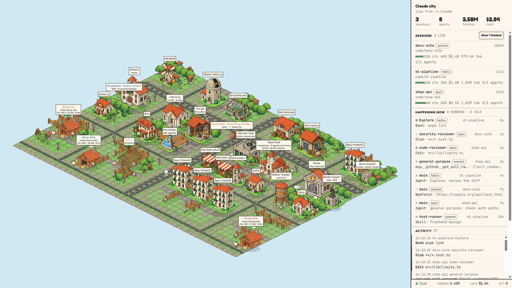
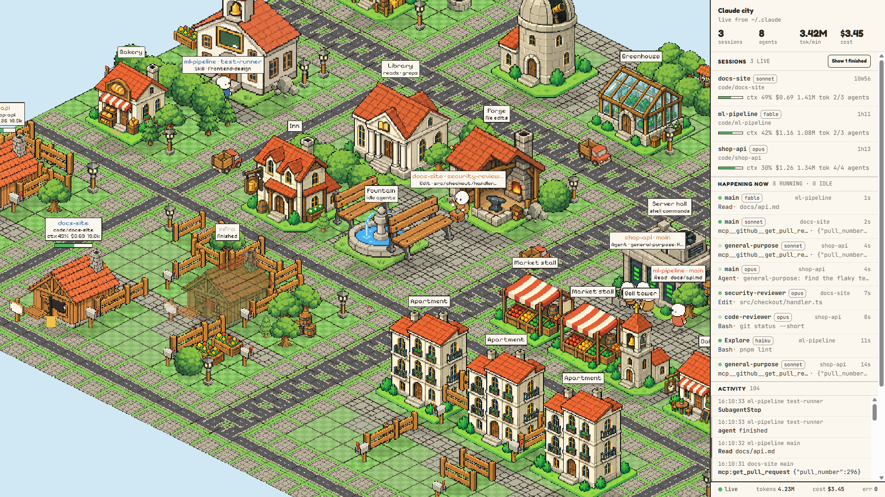
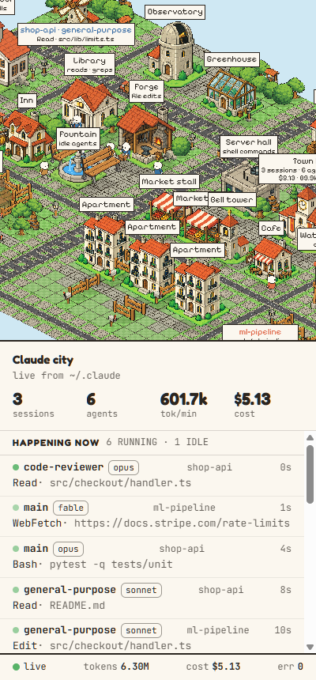
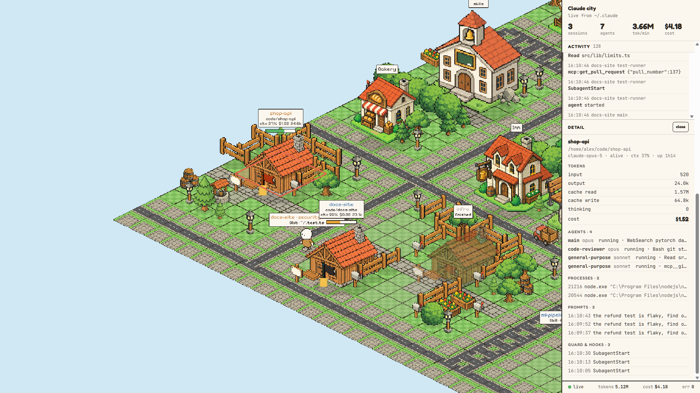

# Claude City

**Watch every Claude Code session on your machine as a living pixel-art city.**

[](https://github.com/Magicianhax/claude-city/actions/workflows/ci.yml)


[](LICENSE)



Every session is a house. Its agents and subagents are citizens who walk across town to do their
work: the **Library** when they read or search, the **Forge** when they edit files, the **Server hall**
when they run shell commands, the **Radio tower** for web and MCP calls, the **Town hall** when they
spawn subagents. Background shells drive around as cars. A blocked command sends a guard running.

The panel beside the city tells the same story in words: which agent is doing what right now, tokens
per minute, cost, how full each context window is, and a live feed of every tool call.

Everything runs locally. There is no account, no telemetry and no build step, and the server has no
runtime dependencies.

## Install as a Claude Code plugin

In Claude Code:

```
/plugin marketplace add Magicianhax/claude-city
/plugin install cc-city@claude-city
```

Start a new session (or run `/reload-plugins`). The first session starts the city and tells you where
it is: <http://127.0.0.1:4888>. From then on, every Claude Code session on the machine reports into
it. The hooks run asynchronously, so they never slow a session down.

Requirements: Node ≥ 20 on your PATH. [docs/INSTALL.md](docs/INSTALL.md) covers updating, the
exact context-window figure, installing without the plugin, and watching from your phone.

## Try it in ten seconds

You don't need Claude Code running to see it. The demo fills a throwaway `.claude` folder with
fictional sessions and keeps them busy:

```sh
git clone https://github.com/Magicianhax/claude-city.git
cd claude-city
npm run demo
```

Open <http://127.0.0.1:4890>. Press Ctrl+C to stop; the demo deletes its temp folder on the way out.
Every screenshot in this README comes from the demo, so every name and path in them is made up.

## Without the plugin

```sh
node server.mjs
```

Open <http://127.0.0.1:4888>. Running sessions show up within a few seconds, because the server reads
the transcripts under `~/.claude` directly. Adding the hooks by hand gives the same detail as the
plugin; [docs/INSTALL.md](docs/INSTALL.md) has the snippet.

## What you're looking at

| In the city | Means |
|---|---|
| A house with a sign | A session, named after its project, with a context bar (`ctx 42%`, estimated from the transcript) and a coin stack for its cost |
| A citizen walking to the **Library** | `Read`, `Grep`, `Glob` |
| … at the **Forge** | `Edit`, `Write`, `NotebookEdit` |
| … at the **Server hall** | `Bash`, `PowerShell` |
| … at the **Radio tower** | `WebFetch`, `WebSearch`, any `mcp__*` tool |
| … at the **Town hall** | `Agent`, `Workflow`: a subagent is about to leave the building |
| … at the **School** | `Skill` |
| … resting in the **Park** | An idle agent. Hover it, or select its session, to see its name |
| A car or truck | A shell or process that a session started |
| A guard running from the **Guard post** | A hook blocked a command |
| A felled tree | Someone ran `rm -rf` |
| A dimmed house | A session that has finished |

Body colour shows the model: Fable is terracotta, Opus wood, Sonnet blue, Haiku stone.

<table>
<tr>
<td width="62%"></td>
<td width="38%"></td>
</tr>
<tr>
<td>Zoomed in: each plate reads <code>session · agent</code> over <code>tool · what it is touching</code>.</td>
<td>On a phone, the panel becomes a bottom sheet.</td>
</tr>
</table>



*Click a house, a citizen or a session row for the details: tokens by kind, estimated cost, agents,
processes, recent prompts and hook events. Finished sessions can be replayed from their transcripts.*

## Platform support

| | Process listing | Hooks | Verified |
|---|---|---|---|
| Windows 11 | `pwsh` (`Get-CimInstance Win32_Process`) | Node | End to end |
| Linux | `ps -axo pid=,ppid=,lstart=,comm=,args=` | Node | End to end on Ubuntu 24.04, and in CI |
| macOS | the same `ps` command | Node | Test suite in CI. The `ps` parser is tested against real macOS output, but nobody has run the full tool on a Mac yet |

## Privacy and security

Your prompts, file paths and commands never leave the machine. The only outbound requests are the
fonts and two pinned CDN scripts that the page loads.

- **Loopback by default.** The server binds `127.0.0.1`. The hook-started server always does, so
  exposing it to your network is always something you type (`--host 0.0.0.0`).
- **A token off loopback.** With `--host`, the server prints a one-time token in the URL and requires
  it on every route, then keeps it in an HttpOnly, SameSite=Strict cookie.
- **Host and Origin checks on every route.** A web page you happen to visit can't read the dashboard
  through DNS rebinding or post fake events. `/hook` and `/status` also require `application/json`.
- **Secrets are masked before they are stored.** Command lines, tool summaries and prompts go through
  `lib/redact.mjs`, which blanks values after `token=`, `key=`, `password=` and similar names, passwords
  in connection strings, and long opaque runs.
- **A Content-Security-Policy** limits the page to its own origin and the two CDN origins it uses, with
  `nosniff` on every response. Both CDN scripts are pinned by SHA-384.

Known gaps are listed in [SECURITY.md](SECURITY.md), with how to report a vulnerability.

## How it works

```
Claude Code hooks ──POST──▶      ┐
~/.claude transcripts ──tail──▶  ├── server.mjs ──SSE──▶ browser: Phaser city + panel
OS process table ──poll──▶       ┘
```

- `lib/ingest.mjs` tails the JSONL transcripts and watches the session registry.
- `lib/procs.mjs` polls the process tree every 3 seconds and backs off when the OS is slow.
- `lib/store.mjs` keeps everything in memory, adds up tokens and estimates cost from `lib/prices.json`.
- `public/game/` draws the city with Phaser, and `public/app.mjs` draws the panel. Both read one SSE
  stream, so they always agree.

[docs/ARCHITECTURE.md](docs/ARCHITECTURE.md) has the full map. [docs/DECISIONS.md](docs/DECISIONS.md)
records why it is built this way, and [DESIGN.md](DESIGN.md) is the visual system.

## Development

```sh
npm run verify     # the whole test suite: node:test only, no network, no browser
npm run demo       # fictional sessions on port 4890
                   # http://127.0.0.1:4888/dev.html shows the city alone, driven by a static fixture
```

The city is generated, processed and committed, so a clone needs none of the steps below. Run them
only if you want a different city:

```sh
node tools/gen-art.mjs <sheet>   # regenerate a sprite sheet with OpenAI Images (needs OPENAI_API_KEY)
npm run art:prep                 # chroma-key, trim and pack the sheets into public/assets/atlas
npm run map:build                # build the Tiled map from the ASCII layout in lib/citymap.mjs
```

The city layout is ASCII art in `lib/citymap.mjs`, and buildings are placed from the map data, so
adding a district needs no code changes. `tools/gen-art.mjs` reads `OPENAI_API_KEY` from the
environment or a `.env` file and never prints it.

## Built with

- **[Phaser 3.90](https://phaser.io/)** (MIT) for the isometric scene, loaded from jsDelivr through an
  import map
- **[easystar.js 0.4.4](https://github.com/prettymuchbryce/easystarjs)** (MIT) for pathfinding along
  the streets
- **[Pixelify Sans](https://fonts.google.com/specimen/Pixelify+Sans)**, **Fredoka** and **JetBrains
  Mono** (SIL Open Font License) from Google Fonts
- **[pngjs](https://github.com/pngjs/pngjs)** (MIT), the only npm dependency, used by the art
  pipeline and its tests
- Sprites generated with OpenAI's image model, then cut and packed by `tools/prep-art.mjs`
- The map uses the [Tiled](https://www.mapeditor.org/) JSON format

## License

[MIT](LICENSE). Claude City is a community project. It is not made, endorsed or supported by Anthropic.
