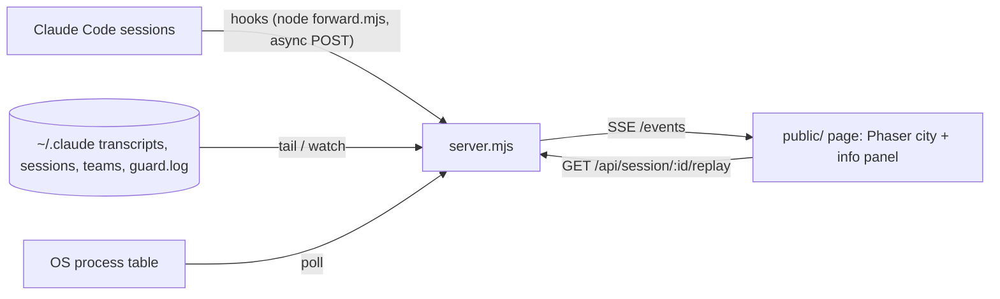

# Architecture

## System map

## Components

| Component | Path | Runtime | Owns |
|---|---|---|---|
| Ingest | `lib/ingest.mjs`, `lib/tail.mjs`, `lib/transcript.mjs`, `lib/procs.mjs` | Node ≥ 20 | reading `~/.claude`, hook payloads, process tree |
| Store | `lib/store.mjs`, `lib/cost.mjs`, `lib/prices.json` | Node | in-memory model, aggregation, cost, change events |
| Server | `server.mjs` | Node `node:http` | `/hook`, `/status`, `/events` (SSE), `/api/*`, static |
| Hooks | `hooks/forward.mjs`, `hooks/start.mjs`, `hooks/hooks.json` | Node (plugin hooks, async) | never-block bridge from Claude Code; starts the server on SessionStart |
| Plugin | `.claude-plugin/plugin.json`, `.claude-plugin/marketplace.json` | Claude Code plugin system | installs the hooks as `cc-city@claude-city` |
| City | `public/game/` | Phaser 3 (importmap from jsdelivr), easystar.js, Tiled JSON map | the scene: buildings, citizens, cars, guard |
| Panel | `public/app.mjs`, `public/index.html` | vanilla ESM | SSE client, sessions list, now-view, activity feed, detail, replay |
| Art pipeline | `tools/gen-art.mjs`, `tools/prep-art.mjs` | Node + OpenAI Images + pngjs | generate sheets, chroma-key, atlas JSON |

## Data

- Store: in-memory only; replay re-reads JSONL on demand. No database.
- Schema source of truth: `lib/store.mjs` (Session / Agent / Tokens / ToolCall / Proc) and the spec §3.
- Migrations: none.

## External services and trust boundaries

| Service | Used for | Credential location | Trust |
|---|---|---|---|
| Claude Code hooks + `~/.claude` files | all runtime data | none | untrusted input; every parser is try/catch, server never 500s |
| OpenAI Images API | `tools/gen-art.mjs` only, developer-time | `OPENAI_API_KEY` in `../.env.local` (git-ignored, never printed) | untrusted output (images) |
| jsdelivr CDN | Phaser, easystar at page load | none | pinned versions |

## Key invariants

- Server binds `127.0.0.1` unless `--host` is passed explicitly; nothing is sent off-machine.
- Hooks exit 0 in < 1 s regardless of server state (`--connect-timeout 0.3 -m 1 || true`).
- Unknown model cost is `null`, rendered as `?`, never `$0.00`.
- Process listing is per-OS (`pwsh` on Windows, `ps` elsewhere) behind one `listProcesses()`; any failure yields `[]`.
- Never write inside `~/.claude`.

## Verify

`npm run verify` = `node --test test/*.test.mjs` (unit + endpoint smoke, < 60 s). Visual gate: Chrome check of `/` with two live sessions, recorded in `tasks/todo.md`.
